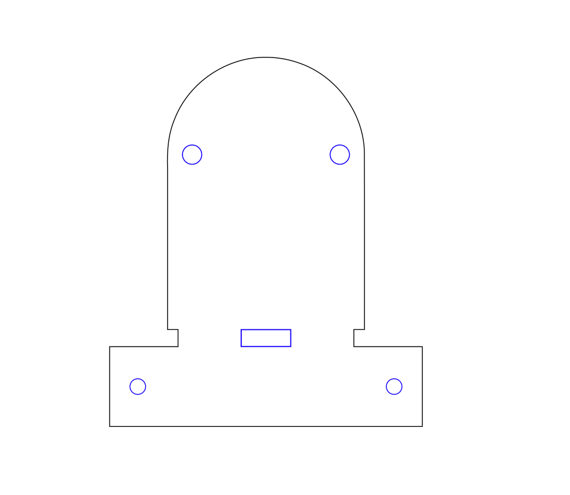
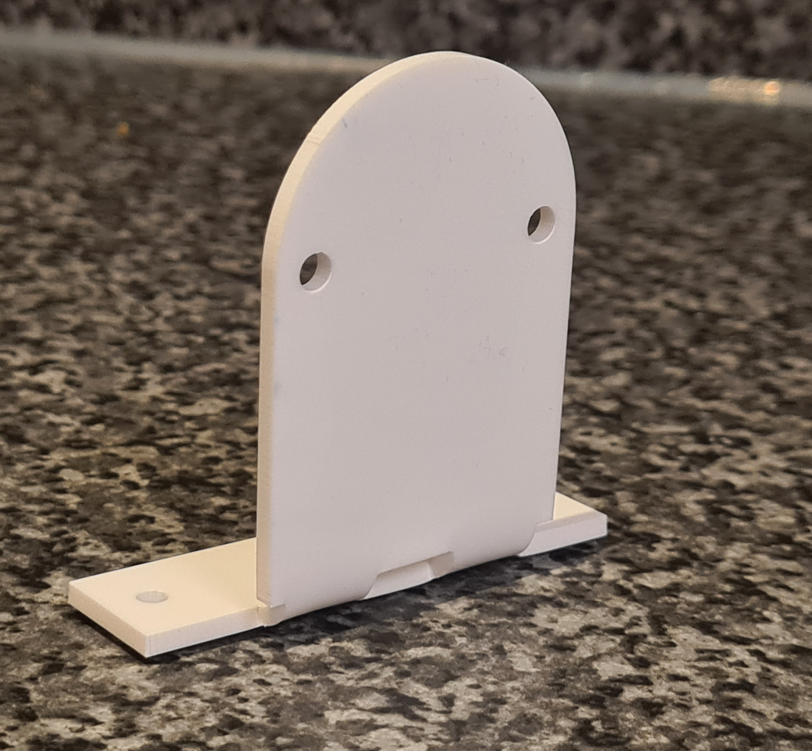
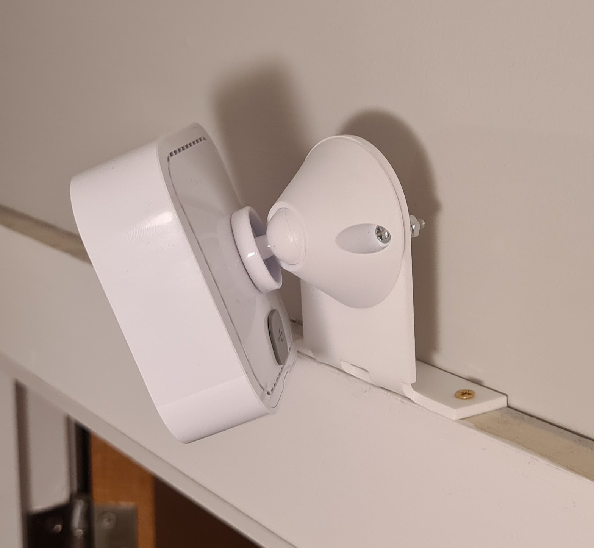

# Blink Indoor Door Mount

I recently bought a [Blink Indoor Camera](https://www.amazon.co.uk/new-blink-indoor-wireless-hd-security-camera-with-2-year-battery-life-motion-detection-two-way-audio-1-camera-system/dp/B088CQSWHB) and needed to mount it somewhere useful. I rent, so I try to avoid drilling into the walls when I can, but while ago I realised I can screw things to the top of wooden door frames, which can then easily be repaired with a dab of paint when I move out.

Here's my attempt at making a door frame mount for the Blink Indoor Camera

## Images

### SVG

### Mount after bending

### Assembled and fitted mount

## Assembly

- Cut the mount out of 2-3mm acrylic with a laser cutter.
- Bend with a strip heater, heat gun or SMD rework station - it might take a few attempts to get it right!
- Bolt the camera stand to the mount with M3 bolts.
- Screw it to the top of the door frame

## Licence

This project is licensed under the [Creative Commons CC BY-NC-SA 4.0](https://creativecommons.org/licenses/by-nc-sa/4.0/) licence.

You are free to share and adapt the code as required, however you *must* give appropriate credit and indicate what changes have been made. You must also distribute your adaptation under the same license. Commercial use is prohibited.

## Acknowledgements

Thanks to the [London Hackspace](https://london.hackspace.org.uk/) for use of the Laser Cutter.

